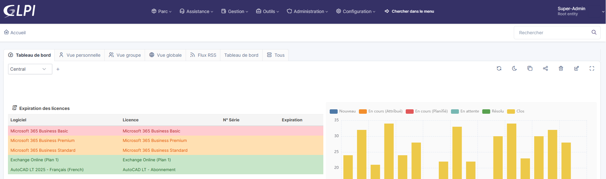
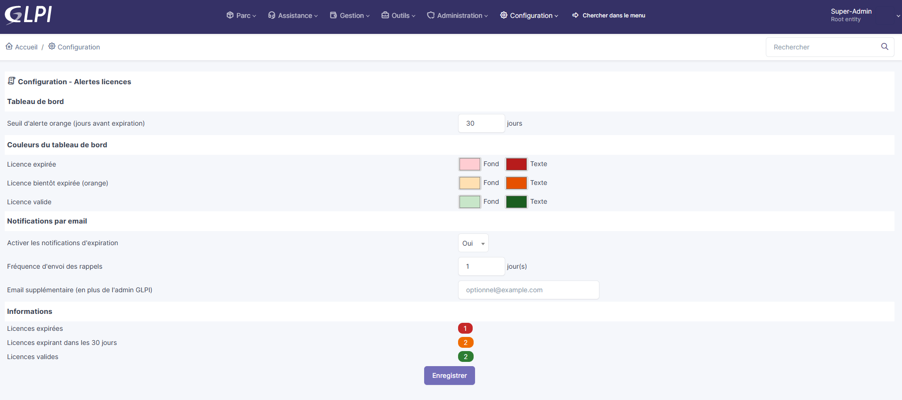

# Alertes Licences - Plugin GLPI

Plugin GLPI pour le suivi et les alertes d'expiration des licences logicielles.

## Apercu

### Tableau de bord

### Configuration

## Fonctionnalites

- **Tableau de bord** : carte affichant les licences avec dates d'expiration, colorees selon leur statut :
  - Rouge : licence expiree
  - Orange : licence expirant bientot (seuil configurable)
  - Vert : licence valide
- **Notifications email** : alertes automatiques pour les licences expirees ou bientot expirees
- **Configuration** : page de parametrage accessible depuis Configuration > Alertes licences
  - Seuil d'alerte (jours avant expiration)
  - Activation/desactivation des notifications
  - Frequence d'envoi des rappels
  - Email supplementaire destinataire
  - Couleurs personnalisables (fond et texte)

## Prerequis

- GLPI >= 11.0

## Installation

1. Copier le dossier `licenseexpiry` dans `/marketplace/` ou `/plugins/` de votre installation GLPI
2. Aller dans **Configuration > Plugins**
3. Installer puis activer le plugin **Alertes licences**
4. Ajouter la carte "Expiration des licences" sur votre tableau de bord central

## Auteur

Jean-Christophe KUBIACZYK

## Licence

GPLv2+
